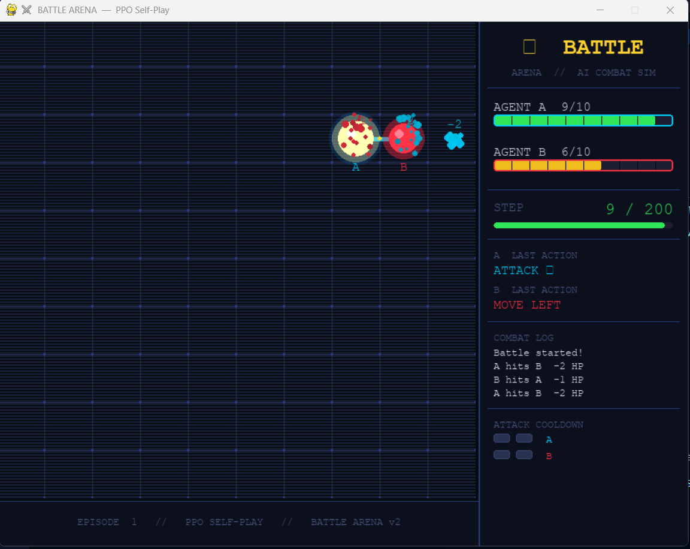

<div align="center">
<br/>

# STRAT**AI**
### Multi-Agent Battle Arena — Reinforcement Learning

<br/>


<br/>

> Two AI agents. One battlefield. Zero hardcoded rules.
> **Every move, every attack, every strategy — learned from scratch.**

<br/>




</div>

---

## What is StratAI?

StratAI is a **multi-agent reinforcement learning** project where two AI agents fight each other on a 10×10 grid battlefield. Neither agent is given any rules or instructions — they figure out how to move, when to attack, when to dodge, and when to retreat entirely on their own through thousands of episodes of trial and error.

This is the same principle behind AI systems used in game development, robotics, and autonomous decision-making — just made visual and accessible.

<br/>

---

## For Complete Beginners — What is Reinforcement Learning?

Think of training a dog. You don't explain what to do in words — you give it a **treat when it does something right** and nothing when it doesn't. Over many repetitions, the dog figures out what gets rewards.

Reinforcement Learning works exactly the same way:

- The **agent** is the AI (the dog)
- The **environment** is the world it lives in (the battlefield)
- The **reward** is the feedback signal (treat or no treat)
- The **policy** is the strategy it develops over time

The agent starts knowing absolutely nothing. By episode 3,000, it has developed real combat tactics.

<br/>

---

## The Six Core RL Concepts — In This Project

| Concept | What It Means | In StratAI |
|---|---|---|
| **Agent** | The AI that makes decisions | Agent A — the learner |
| **Environment** | The world the agent operates in | 10×10 grid battlefield |
| **State** | Snapshot of the current situation | Position, HP, distance, cooldown, time |
| **Action** | Choices available at each step | Move / Attack / Dodge / Wait |
| **Reward** | Feedback — good or bad signal | +5.5 on hit, −3 wasted attack |
| **Policy** | The strategy the agent develops | Learned by the neural network |

<br/>

---

## Key Parameters Explained

| Parameter | What It Does | Value Used |
|---|---|---|
| **Episodes** | Number of full games played during training. More = smarter agent | `3,000` |
| **Gamma (γ)** | How much the agent values future rewards. At 0.99 it plans many steps ahead | `0.99` |
| **Learning Rate** | How fast the neural network updates. Too high = unstable, too low = slow | `3e-4` |
| **PPO Clip (ε)** | Prevents policy from changing too drastically in one update. Keeps training stable | `0.2` |
| **Entropy Bonus** | Keeps the agent exploring instead of getting stuck repeating the same moves | `0.01` |
| **Self-Play Sync** | Every N episodes Agent B becomes a copy of Agent A — always a worthy opponent | `Every 100 ep` |

<br/>

---

## Development — Built in Six Phases

### Phase 1 — Environment Design
Built the grid battlefield from scratch using Gymnasium. Added movement, basic attacks, and a reward system that gives the agent feedback on every single action.

`Grid World` `Movement` `Basic Rewards`

---

### Phase 2 — DQN Training
First attempt used Deep Q-Networks. Quickly discovered that DQN struggles in multi-agent settings — agents got stuck, oscillated, or found degenerate strategies like never moving.

`Problem: Oscillation` `Problem: Instability` `Valuable Lessons Learned`

---

### Phase 3 — PPO Upgrade
Switched to **Proximal Policy Optimization** — an algorithm specifically designed for training stability. Training became smoother and the agent started developing consistent behavior.

`Stable Training` `Better Convergence` `Smooth Behavior`

---

### Phase 4 — Self-Play
Instead of training against a fixed scripted opponent, Agent A now trains against a **frozen copy of itself**. Every 100 episodes the copy updates. This creates an escalating challenge that forces real strategy to emerge.

`AI vs AI` `Periodic Opponent Sync` `Real Strategy Emergence`

---

### Phase 5 — Advanced Combat System
Added attack cooldowns, a dodge system, critical hits, and sequential (turn-order) combat resolution. These mechanics prevent attack spamming and make timing and positioning actually matter.

`Attack Cooldown` `Dodge System` `Critical Hits` `Sequential Combat`

---

### Phase 6 — Showcase Visualization
Built a cinematic Pygame renderer with glowing agents, particle explosions on hit, screen shake on critical strikes, movement trails, HP bars, a rolling combat log, cooldown indicators, and a winner end-screen.

`Particle FX` `Screen Shake` `HP Bars` `Combat Log` `Winner Screen`

<br/>

---

## Problems Hit — And How They Were Solved

This is an honest account of what broke during development and exactly how each issue was fixed.

| Problem | Solution |
|---|---|
| Agent freezes and never moves | Randomised spawn positions — agent can't memorise a single fixed path |
| Agent oscillates between two tiles forever | Visit count penalty — revisiting the same cell costs escalating reward |
| Agent approaches enemy but never attacks | Snapshot adjacency *before* movement so attack checks use the correct state |
| Attack spamming with no repositioning | Attack cooldown system — 2-step lockout after each strike |
| One agent always wins, no real competition | Self-play with periodic sync + randomised damage variance (1–4 per hit) |
| Matches always draw at max steps | HP-differential reward at timeout — higher HP = winner declared |
| Enemy policy falls through on cooldown | Explicit return in every branch of `_enemy_policy()` — no fall-through bug |

<br/>

---

## Project Structure

```
StratAI/
│
├── env/
│   └── battle_env.py          # Grid world, combat logic, reward shaping
│
├── model/
│   └── ppo.py, DQN.py         # Actor-Critic neural network (PPO)
│
├── utils/
│   └── replay_buffer.py       # Experience storage (DQN phase)
│
├── train.py , pp_train.py     # For DQN based training 
├── ppo_selfplay.py            # Main training loop with self-play
├── visualize_game_pro.py      # Cinematic Pygame battle renderer
└── ppo_selfplay.pth           # Saved model weights (generated after training)
```

<br/>

---

## Libraries Used

| Library | Purpose |
|---|---|
| **PyTorch** | Builds and trains the neural network — powers the actor-critic architecture |
| **Gymnasium** | Provides the standard RL environment interface — observation space, action space, step |
| **NumPy** | All numerical operations — state arrays, random damage rolls, position math |
| **Pygame** | Real-time battle visualization with particles, glows, HP bars, and screen effects |

<br/>

---

## How to Run

**1. Clone the repository**
```bash
git clone https://github.com/your-username/StratAI.git
cd StratAI
```

**2. Install dependencies**
```bash
pip install torch pygame gymnasium numpy
```

**3. Train the model**
```bash
python ppo_selfplay.py
```
This runs 3,000 episodes and saves `ppo_selfplay.pth` every 100 episodes. Watch the reward climb in the terminal.

**4. Watch the battle**
```bash
python visualize_game_pro.py
```
Opens the cinematic renderer. Press `R` to restart a match, `Q` to quit.

<br/>

---

<div align="center">

## Built by

### Dhruv Devaliya
*Bit Bard*

<br/>

[](mailto:dhruvdevaliya@gmail.com)
[](https://www.linkedin.com/in/dhruv-devaliya/)
[](tel:+918591216244)

<br/>

*StratAI — Multi-Agent Battle Arena — Reinforcement Learning*

</div>
